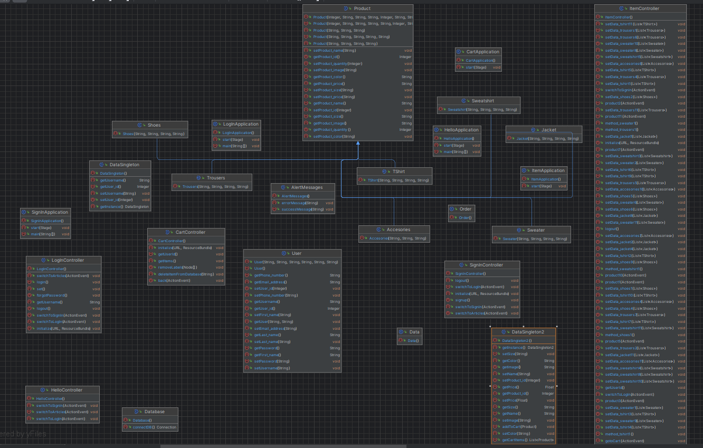
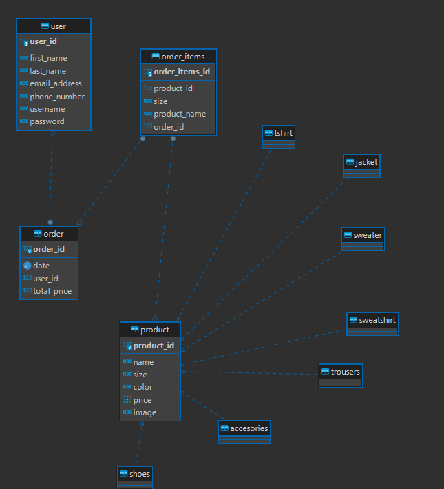
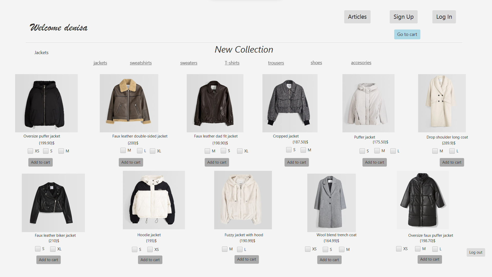
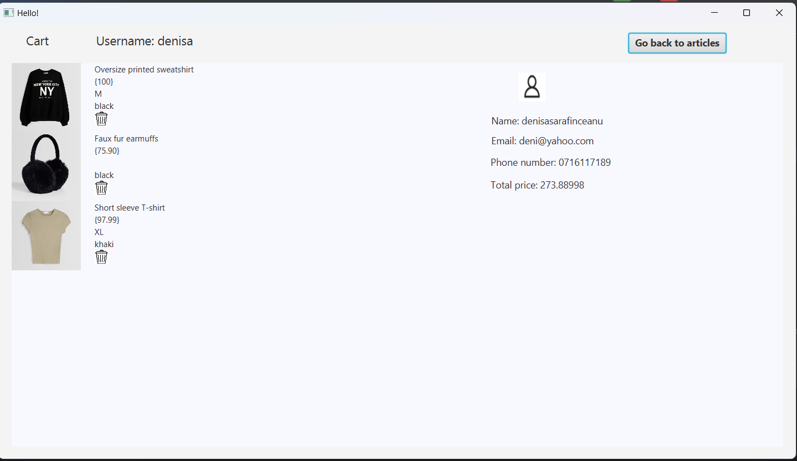

# Fashion Store Project
## An online platform to stay connected to the Fashion!
What can you do on this page?

- Log In / Sign Up
- See the articles and have the opportunity to add them to your cart 
- Keep to the account the items you saved and the total price
 ✨
## Features

- JavaFX Project to generate FXML files and to design the interface of the project
- Scene Builder to make the changes in the FXML file 
- Postgres Database in which the data is stored 

The classes diagram:

The database system:

In both the Java Classes and Database table, I started with the same aproach, in which i have a general class Product and it divides into specific types of products (clothes): jackets, sweatshirts, sweaters, tshirts, trousers, shoes and accesories. The data for each of them is taken from the database and then constructed in the ItemController in which you can select the product you want and the size. 

If you press any of the 'Add to Cart' button, it authomatically inserts in the database the product associated with the user data and it can be visible if the button 'Go to cart' is pressed.

It is also possible to delete from the database by pressing the icon of delete.
